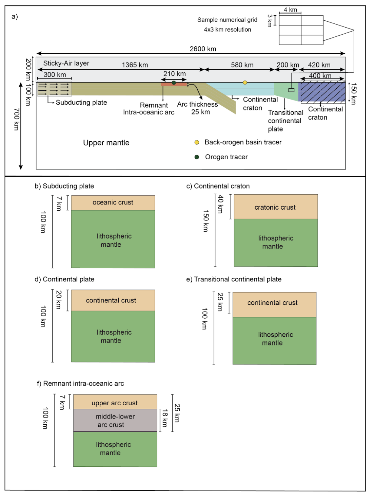
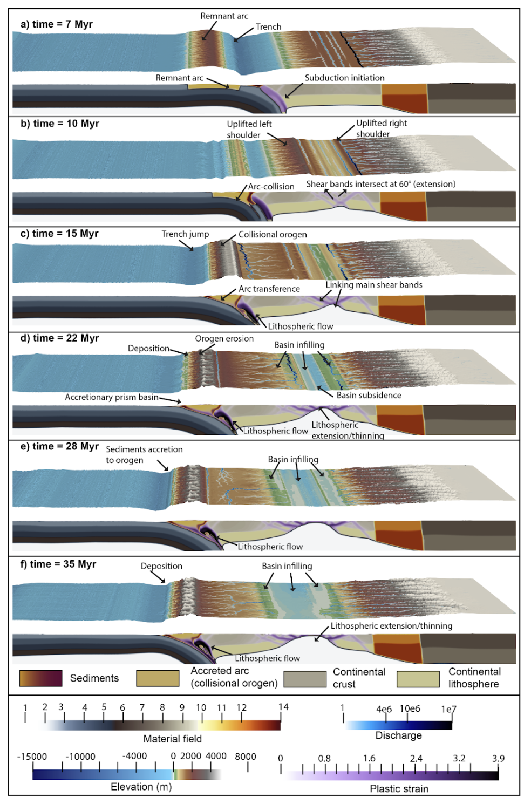
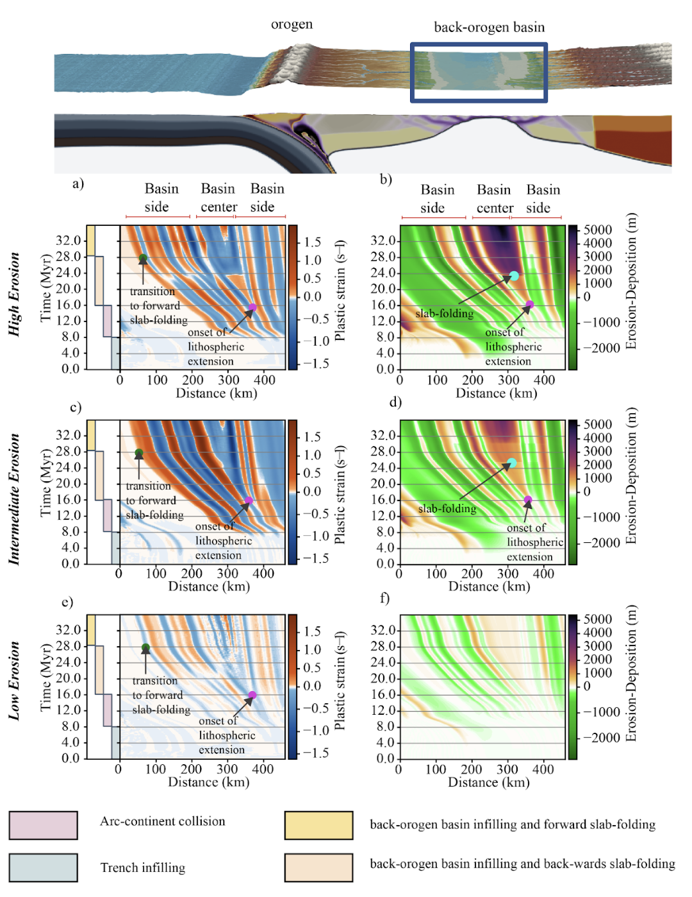
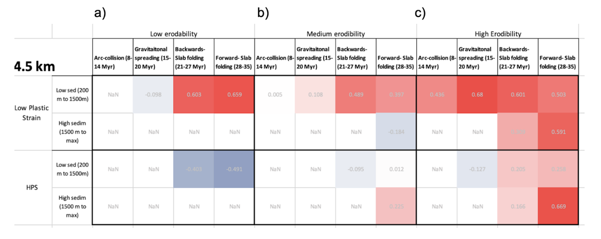
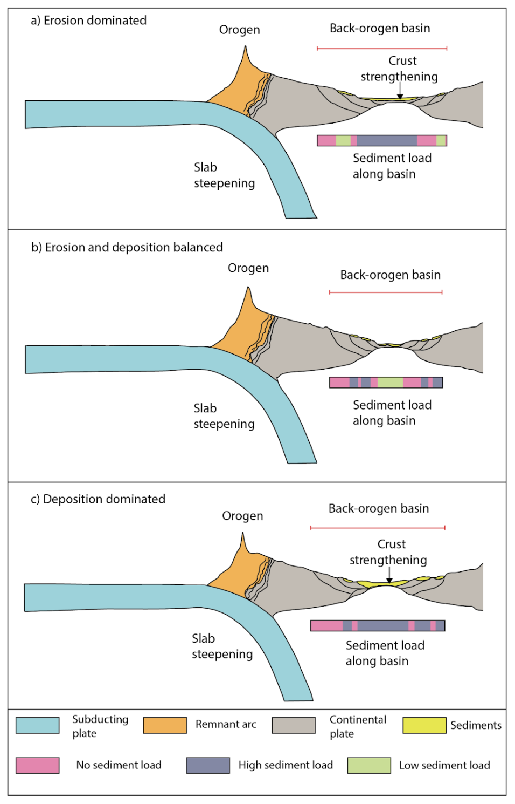

# The role of slab-folding in modulating the landscape evolution of arc-continent collision

## Abstract

Subducting slabs may fold in the 660 km Mantle Transition Zone (MTZ) and cause episodes of increased deformation in accretionary margins, however, their effect in arc-continent collision margins remains poorly understood. Here we investigate how slab-folding impacts the topography evolution of arc-continent collision orogens and the sediment supply to the associated basins, under the effect of different erosion and sedimentation rates. Results show that slab-folding causes the steepening of the subducting slab, which enhances topographic growth in the orogen between 0.008-0.310 mm/yr and increases the sediment thickness between 0.05-0.3 mm/yr. These ranges of uplift rate depend on the erosion rate, which is up to 0.2 mm/yr in our simulations. In the basin, the sedimentation rate not only depends on the erosion rate in the orogen, but on how efficiently sediments are transported to the basin. Results from a correlation test between the plastic strain and the cumulated sedimentation, show that the load of sediments affects deformation at two different spatio-temporal scales. The load caused by sedimentation rates of 0.3 mm/yr or more, enhance the regional deformation that causes lithospheric extension in the basin. Conversely, the load of sedimentation rates below 0.3 mm/yr increase the localized deformation that causes tectonic subsidence in normal faults. These results highlight how high erosion rates (0.2 mm/yr) control the topography evolution of the orogen, and how sedimentation rates enhances regional deformation or/and localized tectonic subsidence in the basin.

### Model setup

### Topography evolution of arc-continent collision

## Erosion-Deposition and deformation in the crust 

## Correlation analysis

## Back-orogen basin modes of deformation

## This repository
Contains the original notebooks  scripts used to ran the numerical simulations presented in the paper: "The role of slab-folding in modulating the landscape evolution of arc-continent collision", within the folder "UWGeodynamics_Badlands_scripts". Additionally, it contains a folder called "Post-processing scripts", which contains the python notebooks used to produce the manuscript figures. Note that these jupyter notebooks need to run inside a Badlands docker container as their use the internal Badlands kernel.

Contact andres.rodriguez1@sydney.edu.au for any questions you may have. 
